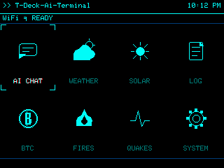

# MayDay T-Deck AI Terminal

MayDay T-Deck AI Terminal is a field-ready firmware build for the LILYGO T-Deck ESP32-S3. It started as an AI chat terminal and now includes a trackball-first launcher, AI persona chat, weather, solar conditions, crypto, field logging, wildfire and earthquake feeds, and system diagnostics.

[](https://www.patreon.com/c/xXQuantumSmokeXx)



## Current Highlights

- Trackball-first UI for launcher navigation and screen scrolling
- AI CHAT with SD-loaded personas and a simple HTTP backend
- WEATHER using Open-Meteo with user-set latitude and longitude
- SOLAR dashboard with NOAA/SWPC space weather, Kp history, 48h forecast, Bz, solar wind, flares, and CME data
- LOG field notes stored on SD card with add, select, edit, and delete support
- BTC crypto screen with up to six CoinGecko favorites, 24h and 7d movement, mini charts, and Fear & Greed
- FIRES feed from NASA EONET open wildfire events
- QUAKES feed from USGS recent earthquake data
- SYSTEM screen for device, WiFi, SD, heap, uptime, backend, persona status, and brightness
- Cyan terminal visual style tuned for the T-Deck display

## Hardware Required

- LILYGO T-Deck, ESP32-S3 version
- microSD card for SD flashing, WiFi bootstrap files, personas, cache, and field logs
- WiFi network for AI backend, weather, solar, crypto, fires, quakes, and NTP

## Flashing

1. Install PlatformIO.
2. Clone this repo.
3. Build the firmware:

```sh
pio run
```

4. Copy the generated firmware to the SD card root:

```sh
copy .pio\build\T-Deck\firmware.bin F:\firmware.bin
```

5. Flash with your T-Deck SD flashing workflow, such as M5Launcher, or flash directly over USB if preferred.

The project also keeps a convenience copy at `firmware.bin` after local builds during development.

## SD Card Setup

The firmware reads a few simple text files from the SD card root or from known folders.

### `wifi.txt`

Place this on the SD card root before first boot:

```txt
YourWiFiSSID
YourWiFiPassword
```

On boot, the firmware saves these credentials to NVS. Delete `wifi.txt` manually after setup if you do not want WiFi credentials left on the SD card.

### `portal.txt`

Place your AI backend base URL on the first line:

```txt
https://your-server-url.ngrok-free.app
```

The firmware posts chat requests to:

```txt
{portal_url}/simple
```

Expected request body:

```json
{
  "message": "hello",
  "system": "persona system prompt",
  "context": [
    { "role": "user", "content": "previous message" },
    { "role": "assistant", "content": "previous reply" }
  ]
}
```

Expected response body:

```json
{
  "response": "assistant reply text"
}
```

You can also change the backend from AI CHAT by typing `seturl`.

### `donki.txt` Optional

SOLAR works out of the box with NASA's public `DEMO_KEY`, but that key has shared rate limits. If you want higher NASA DONKI limits, get a free API key from NASA and place it on the first line of `donki.txt` on the SD card root:

```txt
YOUR_NASA_DONKI_API_KEY
```

On boot, the firmware saves this to NVS as `donki_key`. The file is not removed automatically, so if the key is entered wrong you can fix `donki.txt` and reboot. After SOLAR is confirmed working, delete `donki.txt` manually if you do not want the key left on the SD card. If no key is configured, SOLAR continues using `DEMO_KEY`.


### Personas

Optional persona files live in:

```txt
/personas/p1.txt
/personas/p2.txt
/personas/p3.txt
```

Each file uses this format:

```txt
NAME
Title or short role
System prompt text goes here.
It can span multiple lines.
```

Slot 1 has a built-in fallback if `/personas/p1.txt` is missing. Slots 2 and 3 load only when their files exist. In AI CHAT, type `persona` to switch loaded personas.

### Field Logs

The LOG screen writes entries to:

```txt
/logs/field.log
```

The firmware creates and updates this file from the device. Keep the SD card inserted if you want LOG to work.

### Crypto Favorites

The BTC screen can load up to six CoinGecko coin IDs from the SD card root:

```txt
/crypto.txt
```

Use one CoinGecko coin ID per line. These are IDs such as `bitcoin`, `ethereum`, `solana`, or `chainlink`, not ticker symbols such as BTC or ETH.

```txt
bitcoin
ethereum
solana
chainlink
dogecoin
litecoin
```

If `/crypto.txt` is missing, the firmware also checks `/coins.txt`, then falls back to coins saved from the on-device editor or the default Bitcoin/Ethereum pair.

## Controls

### Launcher

- Trackball up/down/left/right: move between tiles
- Enter: open selected tile
- W/A/S/D or I/J/K/L: keyboard navigation

### Module Screens

- Trackball left/back gesture: return home
- Q, Escape, Ctrl+Q, or Backspace: return home on most screens
- R: refresh on data screens that support it

### AI CHAT

- Type a message and press Enter to send
- Trackball up/down: scroll chat history
- `seturl`: change AI backend URL
- `setwifi`: change WiFi credentials
- `persona`: switch loaded persona slot
- `clear`: clear chat and context
- `b+` / `b-`: adjust brightness

### WEATHER

- R: refresh weather
- L: set latitude and longitude
- Q: return home

Weather uses Open-Meteo and stores `wx_lat` and `wx_lon` in NVS after you set them on device.

### LOG

- Type a note and press Enter to save
- W/S or trackball up/down: select or scroll entries
- E: edit selected entry
- D: delete selected entry
- Q: return home

### BTC

- R: refresh crypto data
- C: edit up to six CoinGecko coin ID slots on device
- Q: return home

### SYSTEM

- R: refresh diagnostics
- + / -: adjust screen brightness and save it to device settings
- Q: return home

## Data Sources

| Screen | Source |
| --- | --- |
| WEATHER | Open-Meteo forecast API |
| SOLAR | NOAA/SWPC plus NASA DONKI for flares and CME data |
| BTC | CoinGecko market data, SD/NVS favorite coin IDs, plus Alternative.me Fear & Greed |
| FIRES | NASA EONET open wildfire events |
| QUAKES | USGS earthquake feed |
| SYSTEM | Local ESP32/T-Deck state and brightness setting |
| LOG | Local SD card `/logs/field.log` |

Network feeds use short local caching where implemented so screens still have useful last-known data after a failed refresh.

## Project Layout

```txt
src/main.cpp              Launcher, boot flow, and trackball handling
src/ui/                   Theme, layout, home screen, shared widgets
src/modules/chat.*        AI chat client and persona-aware context
src/modules/weather.*     Weather dashboard and location setup
src/modules/solar.*       Solar and space-weather dashboard
src/modules/btc.*         Crypto dashboard and CoinGecko favorites
src/modules/noaa.*        Field LOG module, replacing the old NOAA alert experiment
src/modules/world.*       FIRES and QUAKES feeds
src/modules/sysinfo.*     SYSTEM diagnostics
src/net/wifi_mgr.*        WiFi/NVS/SD credential handling
src/persona/              SD persona loading and slot selection
sd_card/                  Example SD card files
config-examples/          Legacy provider examples from the earlier AI-only release
```

## Notes For This Release

This release is a major UI and feature update from the earlier AI-only build:

- Removed touch UI assumptions in favor of trackball navigation
- Replaced the failed NOAA alert section with the SD-backed LOG screen
- Added real-time FIRES and QUAKES screens
- Added richer SOLAR visuals and 48h Kp forecast display
- Added configurable CoinGecko crypto favorites and chart layout polish
- Added SYSTEM diagnostics polish, persistent brightness control, and faster load behavior
- Added SD personas, portal URL loading, and on-device backend switching

## Security Notes

- Remove sensitive SD setup files manually after setup when possible.
- `wifi.txt` is not removed automatically. Delete it after WiFi credentials are saved and confirmed working.
- `portal.txt` is not removed automatically. Delete it after the backend URL is saved and confirmed working if desired.
- `donki.txt` is not removed automatically. Delete it manually only after you confirm the NASA key works.
- Persona files may contain private prompts. Treat the SD card accordingly.


