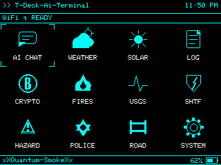

# xXT-Deck-Ai-TerminalXx

A tactical multi-function terminal for the LILYGO T-Deck ESP32-S3, consolidating AI chat, weather, space weather, cryptocurrency tracking, wildfire and earthquake monitoring, SHTF situational awareness, traffic and hazard alerts, offline tarot divination, field logging, scripture and reference reading, live news feeds, and system diagnostics into a single portable device.

Built by xXQuantum-SmokeXx, with development assistance from Codex and Claude Code.

[](https://www.patreon.com/c/xXQuantumSmokeXx)



## Display Gallery

| AI Chat | Weather | Solar |
| --- | --- | --- |
|  |  |  |

| CODEX | Crypto | Fires |
| --- | --- | --- |
|  |  |  |

| USGS | System | Home (Theme) |
| --- | --- | --- |
|  |  |  |

## Features

- **AI CHAT** — SD-loaded personas, named assistants, HTTP backend with full conversation context
- **WEATHER** — Open-Meteo forecast with user-configured latitude and longitude, 5-day strip, stats row
- **SOLAR** — NOAA/SWPC space weather: Kp history, 48h forecast, Bz, solar wind speed, flares, and CME data
- **CODEX** — Dual-mode hub: **MY LOGS** (field notes on SD card, add/edit/delete with trackball cursor navigation) and **LIBRARY** (KJV scripture reader and other SD-hosted books with chapter index and paragraph-reflowed text)
- **CRYPTO** — Up to six CoinGecko favorites, 24h/7d movement, 7-day sparklines, and Fear & Greed index
- **FIRES** — NASA EONET open wildfire events, live feed
- **USGS** — Recent M3.5+ earthquake feed from USGS FDSNWS
- **SHTF** — Situational awareness monitor: NWS real-time active alerts, FEMA declared disasters (with USGS significant earthquake fallback), CDC/ProMED outbreak feed, and a combined threat index. GPS-located. NVS-cached.
- **TRAFFIC** — Nearby Waze hazards and road incidents within 2 km of your GPS location
- **ORACLE** — Offline tarot reader: single card, three-card (Past/Present/Future), and five-card Celtic Cross spreads. Full 78-card deck with authentic upright and reversed meanings. Trackball and touch navigation, optional SD save.
- **NEWS** — Live RSS headlines from CDC, WHO, ABC News, and BBC World. NVS-cached, 30-minute TTL.
- **SYSTEM** — Device, WiFi, SD, heap, uptime, backend, persona status, and brightness control
- All data screens NVS-cache their last successful fetch for instant load and offline resilience

## Hardware Required

- LILYGO T-Deck, ESP32-S3 version
- microSD card for WiFi bootstrap, personas, cache, field logs, and library books
- WiFi network for AI backend, weather, solar, crypto, fire/quake feeds, and NTP sync

## Flashing

**Option 1 — M5Launcher (SD card, no USB required):**

1. Grab `Ai-Field-Terminal.bin` from the [latest release](https://github.com/xXQuantumSmokeXx/T-Deck-Ai-Terminal/releases/latest) and copy it to your SD card root.
2. Boot into M5Launcher on the T-Deck.
3. Select `Ai-Field-Terminal.bin` and flash.

**Option 2 — Build and flash from source:**

1. Install PlatformIO and clone this repo.
2. Flash directly over USB:

```sh
pio run --target upload
```

Or build the binary and copy it to SD for M5Launcher:

```sh
pio run
copy .pio\build\T-Deck\firmware.bin F:\Ai-Field-Terminal.bin
```

## SD Card Setup

The firmware reads plain text files from the SD card root on boot. All setup files are optional after initial configuration — credentials and settings are persisted to NVS.

### `wifi.txt`

Plain two-line format: line 1 is the SSID, line 2 is the password. Do not include labels like `SSID:` or `Password:`.

Example, if the SSID is `frog` and the password is `strawberry`:

```txt
frog
strawberry
```

Read on boot, saved to NVS. Delete after confirmed working.

### `portal.txt`

```txt
https://your-server-url.ngrok-free.app
```

Sets the AI backend base URL. Chat requests go to `{portal_url}/simple`. Delete after confirmed working if desired.

**Expected request body:**

```json
{
  "message": "hello",
  "system": "persona system prompt",
  "context": [
    { "role": "user", "content": "previous message" },
    { "role": "assistant", "content": "previous reply" }
  ]
}
```

**Expected response body:**

```json
{ "response": "assistant reply text" }
```

You can also change the backend URL from within AI CHAT by typing `seturl`.

### `tomtom.txt` — Optional

The TRAFFIC screen uses the [TomTom Traffic Incidents API](https://developer.tomtom.com). Get a free API key and place it on the first line:

```txt
YOUR_TOMTOM_API_KEY
```

Saved to NVS on boot as `tomtom_key`. Delete after confirmed working.

### `donki.txt` — Optional

SOLAR uses NASA's public `DEMO_KEY` by default. For higher rate limits, get a free key at [api.nasa.gov](https://api.nasa.gov) and place it on the first line:

```txt
YOUR_NASA_DONKI_API_KEY
```

Saved to NVS on boot. Delete after confirmed working.

### Personas

Persona files live in `/personas/` on the SD card:

```txt
/personas/p1.txt
/personas/p2.txt
/personas/p3.txt
```

**File format:**

```txt
NAME
Title or short role
System prompt text goes here.
It can span multiple lines.
```

Slot 1 has a built-in fallback if `/personas/p1.txt` is missing. Slots 2 and 3 load only when their files are present. Type `persona` in AI CHAT to cycle slots. Type `setassist1` or `setassist2` to configure the display name shown in the chat header for each slot.

### MY LOGS (CODEX)

The CODEX MY LOGS screen writes field notes to `/logs/field.log`. The firmware creates this file automatically. Keep the SD card inserted for MY LOGS to work. Use the trackball to move the selection cursor, then press **E** to edit or **D** to delete the selected entry.

### LIBRARY (CODEX)

Place plain text books in the SD card root. The firmware auto-indexes them on first open and caches the chapter index in a binary `.idx` file.

**[Project Gutenberg](https://www.gutenberg.org)** is the best source for free plain-text books — tens of thousands of public domain titles including the Bible, classic literature, field manuals, and reference works. Download the **Plain Text UTF-8** version of any title and copy it to your SD card root.

```txt
/kjv.txt          ← KJV Bible (primary tested title)
/warpeace.txt     ← War and Peace, or any Gutenberg plain text
/meditations.txt  ← Marcus Aurelius, etc.
```

The firmware indexes any file matching `/*.txt` in the SD root. Gutenberg format works out of the box — paragraph reflow corrects the 70-character line wrapping so verses and paragraphs read as continuous text. Chapter headings are detected automatically using a blank-line sandwich heuristic (blank line before and after the heading). Any plain-text book with that structure will index cleanly.

**Tips for best results:**
- Use the **Plain Text UTF-8** download option on Gutenberg — avoid HTML or EPUB
- The KJV Bible (`kjv.txt`) is the primary tested title and is confirmed working
- Very large files (500KB+) take a few seconds to index on first open; subsequent opens are instant from the cached `.idx` file
- If a book indexes poorly, check that its chapter headings are each on their own line with a blank line above and below

### Crypto Favorites

Load up to six CoinGecko coin IDs from `/crypto.txt` (one per line):

```txt
bitcoin
ethereum
solana
chainlink
dogecoin
litecoin
```

Use CoinGecko slugs, not ticker symbols. Falls back to `/coins.txt`, then to any on-device saved coins, then to the default BTC/ETH pair.

## Controls

### Launcher

| Input | Action |
| --- | --- |
| Trackball up/down/left/right | Move between tiles |
| Trackball click (press ball) | Open selected tile |
| Enter | Open selected tile |
| W/A/S/D or I/J/K/L | Keyboard tile navigation |

### Module Screens

- **Trackball roll right** or **Q / Escape / Backspace / Delete**: return home
- **R**: refresh on data screens that support it

### AI CHAT

| Command | Action |
| --- | --- |
| Type + Enter | Send message |
| Trackball up/down | Scroll chat history |
| `seturl` | Change AI backend URL |
| `setwifi` | Change WiFi credentials |
| `setassist1` / `setassist2` | Set chat display name for persona slot 1 or 2 |
| `persona` | Cycle loaded persona slot |
| `clear` | Clear chat history and context |

### CODEX — MY LOGS

| Input | Action |
| --- | --- |
| Type + Enter | Add a new log entry |
| Trackball up/down | Move selection cursor |
| E | Edit selected entry |
| D | Delete selected entry |
| Del / Backspace | Return to home |

### CODEX — LIBRARY

| Input | Action |
| --- | --- |
| Trackball up/down | Scroll page / navigate chapter list |
| Enter | Open selected chapter |
| Q / Backspace | Back / return to home |

### WEATHER

- **R**: refresh — **L**: set latitude/longitude — **Q**: home
- Coordinates saved to NVS as `wx_lat` / `wx_lon`

### CRYPTO

- **R**: refresh — **C**: open on-device coin ID editor (up to six slots) — **Q**: home

### ORACLE

| Input | Action |
| --- | --- |
| Trackball up/down or W/S | Navigate menu / scroll interpretation |
| Trackball left/right | Navigate spread cards (Past → Present → Future) |
| Enter | Draw cards / confirm selection |
| Touch tab bar | Jump directly to that spread position |
| Touch left/right edge | Previous / next card |
| R | Save reading to SD (`/oracle/readings/`) |
| Q / Backspace / Delete | Back / exit |

### SHTF

- **R**: force refresh all feeds — **L**: enter lat/lon manually — **G**: acquire hardware GPS — **Q**: home
- Trackball up/down scrolls the outbreak list
- GPS coordinates shared with TRAFFIC screen (stored as `waze_lat` / `waze_lon` in NVS)
- FIPS county and state cached in NVS (`shtf_fips`, `shtf_county`, `shtf_state`). Cleared automatically when you change location.

### TRAFFIC

- **R**: force refresh — **L**: enter lat/lon — **G**: acquire hardware GPS — **Q**: home
- Trackball up/down scrolls the alert list
- Requires a TomTom API key in `tomtom.txt` on the SD card (see SD Card Setup above)

### NEWS

- **R**: force refresh — **Q**: home
- Trackball up/down scrolls headlines
- Cached for 30 minutes in NVS; stale indicator shown when displaying cached data

### SYSTEM

- **R**: refresh diagnostics — **+** / **-**: adjust brightness (saved to NVS) — **T**: open theme color picker — **D**: edit display name — **Q**: home

## Data Sources

| Screen | Source |
| --- | --- |
| WEATHER | Open-Meteo forecast API |
| SOLAR | NOAA/SWPC + NASA DONKI (flares, CME) |
| CRYPTO | CoinGecko markets + Alternative.me Fear & Greed |
| FIRES | NASA EONET open wildfire events |
| USGS | USGS FDSNWS earthquake feed |
| SHTF | NWS active alerts + FEMA declared disasters + USGS significant earthquakes (fallback) + CDC/ProMED RSS |
| TRAFFIC | TomTom Traffic Incidents API (requires `tomtom.txt` key on SD) |
| NEWS | CDC, WHO, ABC News, BBC World RSS feeds |
| ORACLE | Fully offline — no network required |
| CODEX MY LOGS | Local SD card `/logs/field.log` |
| CODEX LIBRARY | Local SD card plain text books |
| SYSTEM | Local ESP32-S3 state |

All data screens NVS-cache their last successful fetch so they display instantly on re-open and stay useful during brief offline periods. Press **R** on any data screen to force a fresh fetch.

## Security Notes

All SD setup files persist until you delete them. Remove them manually after confirming each works.

- **`wifi.txt`** — contains WiFi credentials
- **`portal.txt`** — contains your backend URL
- **`tomtom.txt`** — contains your TomTom API key
- **`donki.txt`** — contains your NASA API key
- **Persona files** — may contain private system prompts

Treat the SD card as sensitive. If it is lost or accessed, any remaining setup files are readable in plain text.
